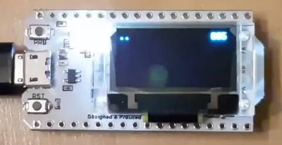

# ESP32-HelloWiFi

A simple WiFi "hello-world" test app for the ESP32 Heltec WiFi Kit 32.

Handles WiFi events & attempt to reconnect when the connection drops. Draws signal a strength icon & an FPS counter on the integrated SSD1306 OLED display.

Assumes https://platformio.org/platformio-ide & VSCode
